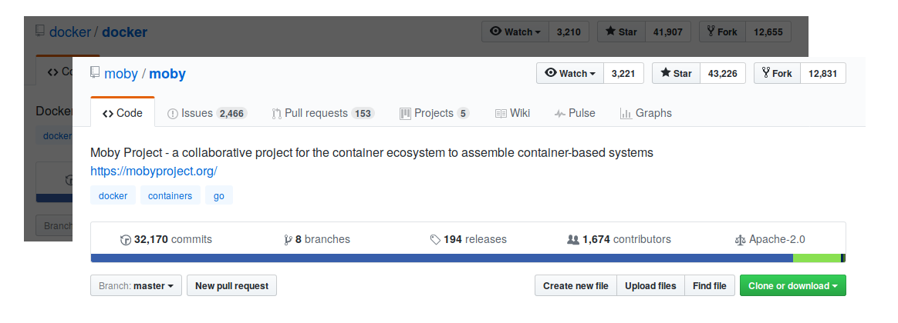
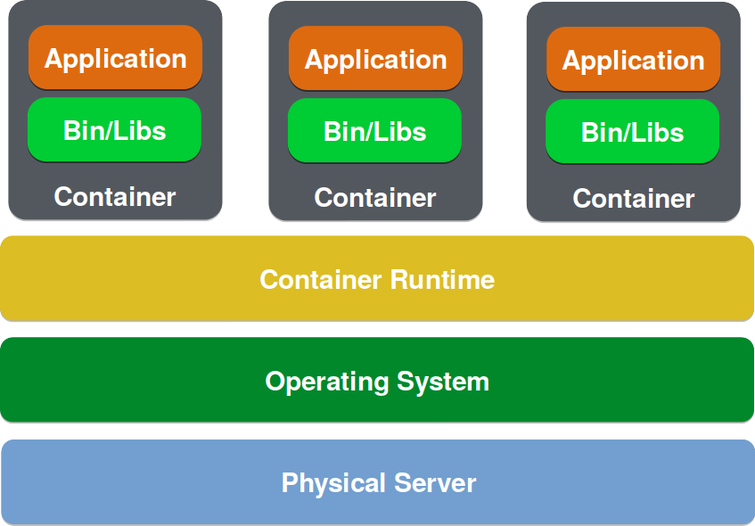
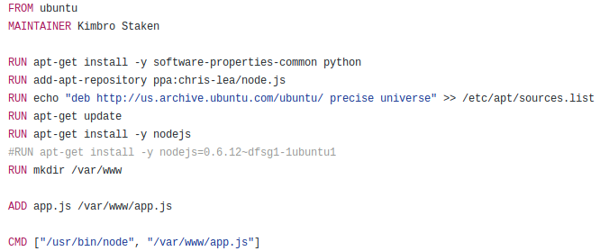
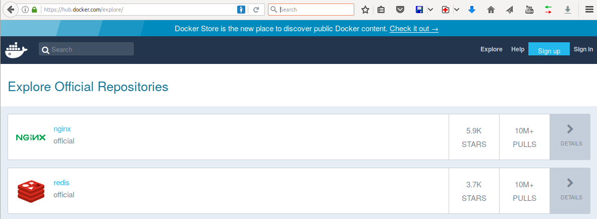
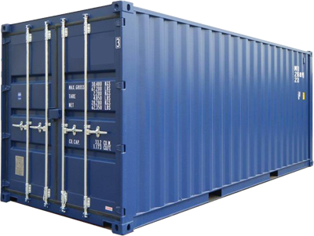

include::includes/_settings.adoc[]

:revealjs_theme: sobkowiak-cg-craftsmanship
:speaker: Krzysztof Sobkowiak (http://twitter.com/ksobkowiak[@ksobkowiak])
:speaker-title: The Apache Software Foundation Member, Senior Solution Architect at Capgemini
:speaker-email: krzysztof.sobkowiak@capgemini.com
:speaker-blog: http://krzysztof-sobkowiak.net
:speaker-twitter: http://twitter.com/ksobkowiak[@ksobkowiak]

= Package your Application using Docker & Kubernetes

[.noredheader,cols="45%,10%,45%"]
|===
>.^| image:images/docker-logo.png[align="center", width="29%"]
|
<.^| image:images/kubernetes-logo.png[align="center", width="20%"]
|
|===

[.cover]
--

[.event]
Capgemini Craftsmanship Community #82 +
Wrocław, 11th of May 2017

[.newline]
{speaker}
[.speaker-title]
The Apache Software Foundation Member +
Senior Solution Architect at Capgemini
[.logo-left]
image:{template-images-dir}/feather.png[width="60", link="http://apache.org"]
--

// ***************************************************************************
include::includes/about.adoc[]
include::includes/disclaimer-cg.adoc[]
// ***************************************************************************

== Outline

[.noredheader,cols="50%,50%"]
|===
a|
* Docker 101
* Docker for Java developers
* Docker Machine
* Docker Compose
* Swarm Mode
a|
|
|===

// ----------------------------------------------------------------------------

== Docker 101

// ----------------------------------------------------------------------------

=== What is Docker?

* Open source project and company
+

* Used to create containers for software applications

// ----------------------------------------------------------------------------

=== WORA = Write Once Run Anywhere

image::images/wora.png[align="center", width="60%"]

// ----------------------------------------------------------------------------

=== PODA = Package Once Deploy Anywhere

image::images/poda.png[align="center", width="60%"]

// ----------------------------------------------------------------------------

=== VMs vs Containers

[.noredheader,cols="48%,4%,48%"]
|===
^.>| image:images/runtime-virtualization.png[]
|
^.>| 
|
|===

// ----------------------------------------------------------------------------

[%notitle]
=== Docker Mission

image::images/docker-mission.png[background, size=cover]

[NOTE.speaker]
--
* Build -- develop an app using Docker containers with any language and any toolchain
* Ship -- ship the dockerized app and dependencies anywhere -- to QA, teammates, or the cloud -- without breaking anything
* Run -- scale to 1000s of nodes, move between data centers and clouds, update with zero downtime and more
--

// ----------------------------------------------------------------------------

=== Build

[.noredheader,cols="46%,4%,50%"]
|===
.<a|
* Image defined in text-based `Dockerfile`
* List of commands to build the image
+
[source,dockerfile]
----
FROM ubuntu

CMD echo "Hello world"
----
* Docker commands to build the image
+
[source,bash]
----
$ docker build -t org/hello
----
|
.<a| 

* https://docs.docker.com/engine/reference/builder/
|
|===

// ----------------------------------------------------------------------------

=== Ship

[.noredheader,cols="48%,4%,48%"]
|===
.<a|
* Store and distribute Docker images with Docker Registry
** Control where images are stored
** Own image distribution pipeline
** Integrate image storage/distribution in dev workflow
|
.<a|

* Docker commands to push or pull the image
+
[source,bash]
----
$ docker push org/hello
$ docker pull org/hello
----
|
|===

// ----------------------------------------------------------------------------

=== Docker Registry

[.noredheader,cols="48%,4%,48%"]
|===
.<a|
* Docker Hub
** Free-to-use and hosted

|
.<a|
* Docker Trusted Registry
** Commercially supported
** RBAC, LDAP/AD integration, updates, etc
** Can be setup inside firewall
|
|===

// ----------------------------------------------------------------------------

=== Registry Primary Usage

* CI/CD with Docker
** Centrally located base images
** Store individual build images
** Pull tested images to production

// ----------------------------------------------------------------------------

=== Run

[.noredheader,cols="48%,4%,48%"]
|===
.^a|

|
.<a|
* Container built from the image
* Runtime representation of the image
* Self contained execution environment

[source,bash]
----
$ docker run org/hello
----
|
|===

// ----------------------------------------------------------------------------

=== Docker Workflow

image::images/docker-workflow.png[align="center"]

// ----------------------------------------------------------------------------

=== Demo 1

// ----------------------------------------------------------------------------

== Docker for Java Developers

=== !

[source,dockerfile]
----
FROM openjdk

COPY target/hello.jar /usr/src/hello.jar

CMD java -cp /usr/src/hello.jar org.example.App
----

// ----------------------------------------------------------------------------

=== Demo 2

// ----------------------------------------------------------------------------
// ----------------------------------------------------------------------------
// ----------------------------------------------------------------------------
// ----------------------------------------------------------------------------
// ----------------------------------------------------------------------------
// ----------------------------------------------------------------------------

// ***************************************************************************
include::includes/qa-full.adoc[]
include::includes/license-cg.adoc[]
//include::includes/credits.adoc[]
// ***************************************************************************
