include::includes/_settings.adoc[]

:revealjs_theme: sobkowiak-cg
:speaker: Krzysztof Sobkowiak (http://twitter.com/ksobkowiak[@ksobkowiak])
:speaker-title: The Apache Software Foundation Member, Senior Solution Architect at Capgemini
:speaker-email: krzysztof.sobkowiak@capgemini.com
:speaker-blog: http://krzysztof-sobkowiak.net
:speaker-twitter: http://twitter.com/ksobkowiak[@ksobkowiak]

= Orchestrate Your Services on OpenShift using Spring Cloud Kubernetes

//image::title-logo.png[align="center", width="30%"]

[.noredheader,cols="35%,30%,35%"]
|===
>.^| 
^.<| image:images/kubernetes-logo.png[align="center", width="29%"]
<.^| 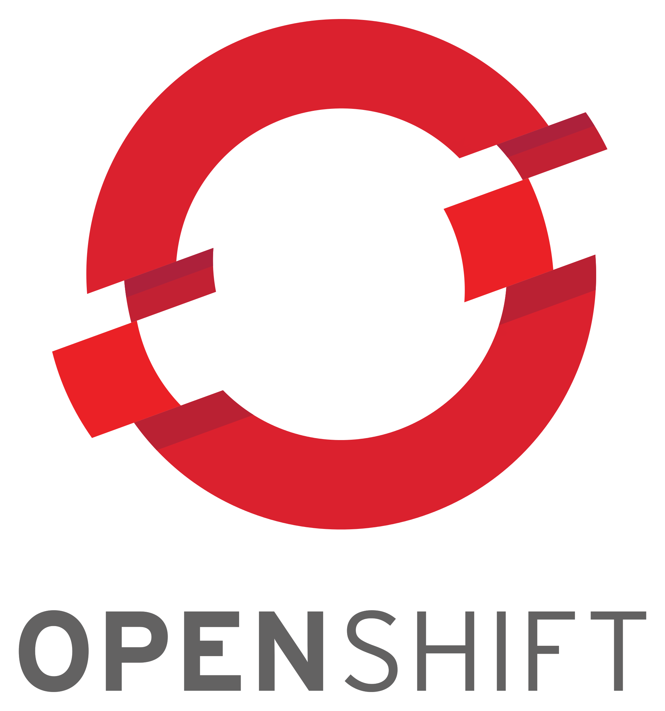
|
|===

[.cover]
--

[.event]
Capgemini Open Day +
Poznań, 13th of June 2017

[.newline]
{speaker}
[.speaker-title]
The Apache Software Foundation Member +
Senior Solution Architect at Capgemini
//[.logo-left]
//image:{template-images-dir}/feather.png[width="60", link="http://apache.org"]
--

// ***************************************************************************
include::includes/about.adoc[]
include::includes/disclaimer-cg.adoc[]
// ***************************************************************************

// ----------------------------------------------------------------------------

[%notitle]
== !

image::images/turbo-camel.png[align="center"]

// ----------------------------------------------------------------------------

[%notitle]
=== !
[.large-text]
Creating business value through software is about speed, safety, iteration, and continuous improvement

// ----------------------------------------------------------------------------

//=== How are you keeping up with change?
//
//* Trying to incorporate new technology?
//* Trying to copy what others (Netflix, Amazon) are doing?
//* Tactical automation?
//* Created a _DevOps_ team?
//* Exploring cloud services?
//* Build/deploy automation?
//* OpenSource?
//* Piecemeal integration?

// ----------------------------------------------------------------------------

//=== Shared infrastructure platforms headaches

//* Different teams
//* Different rates of change
//* VM sprawl
//* Configuration drift
//* Isolation / multi-tenancy
//** Performance
//** Real-time vs batch
//** Compliance
//** Security
//** Technology choices

// ----------------------------------------------------------------------------

=== Typical problems developing microservices

* How to run them all locally?
* How to package them (dependency management)
* How to test?
* Vagrant? VirtualBox? VMs?
* Specify configuration
* Process isolation
* Service discovery
* Multiple versions?

// ----------------------------------------------------------------------------

[%notitle]
== !

[.noredheader,cols="40%,4%,56%"]
|===
^.^| 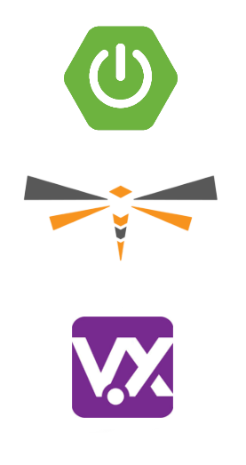
a|
.^a|
* Simple configuration
* Curated dependencies and transitive dependencies
* Built in metrics, monitoring
* Slim profile for deployment (...micro even?)
+
#microprofile
|
|===

// ----------------------------------------------------------------------------

=== Spring Boot

[.noredheader,cols="46%,4%,50%"]
|===
a|
* It can be pretty small...
* Predefined packages/starters available
* Can generate WAR or JAR file
|
a|
[source, java]
----
@RestController
@SpringBootApplication
public class ControllerAndMain {
  private int counter;

  @Autowired
  private Config config;

  @RequestMapping(value = "/ip", method = RequestMethod.GET)
  public IPAddress ipaddress() throws Exception {
      return new IPAddress(++counter,
        InetAddress.getLocalHost().getHostAddress(),
        config.getMessage());
  }

  public static void main(String[] args) {
    SpringApplication.run(
      ControllerAndMain.class, args);
  }
}
---- |
|===

// ----------------------------------------------------------------------------

=== WORA = Write Once Run Anywhere

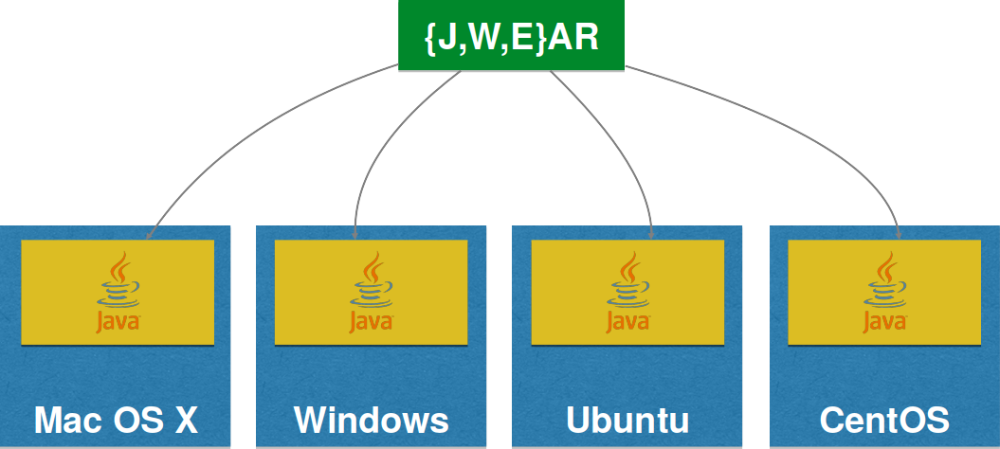

// ----------------------------------------------------------------------------

[%notitle]
=== !

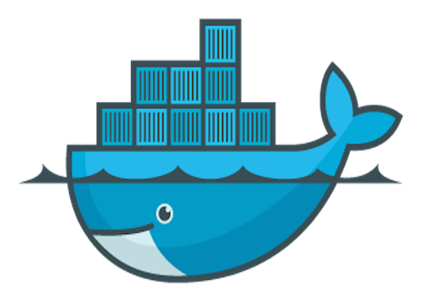

// ----------------------------------------------------------------------------

=== PODA = Package Once Deploy Anywhere

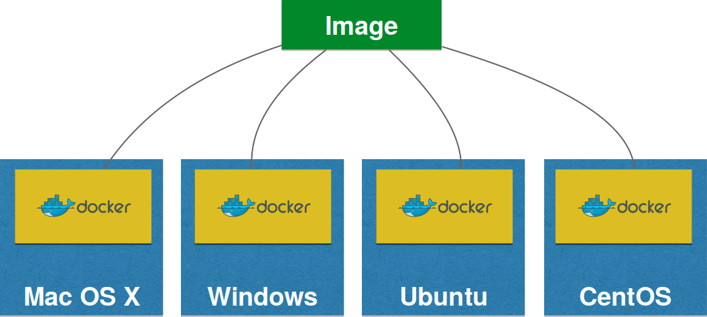

// ----------------------------------------------------------------------------

[%notitle]
=== Docker Mission

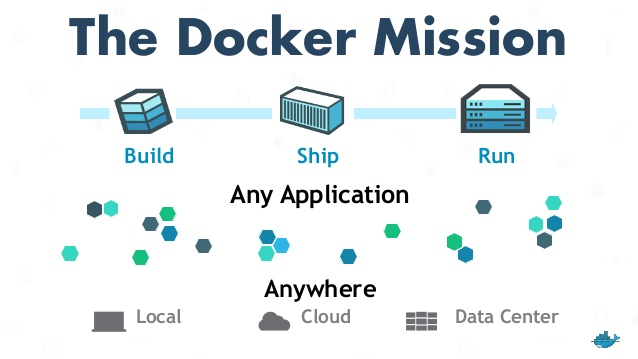

[NOTE.speaker]
--
* Build -- develop an app using Docker containers with any language and any toolchain
* Ship -- ship the dockerized app and dependencies anywhere -- to QA, teammates, or the cloud -- without breaking anything
* Run -- scale to 1000s of nodes, move between data centers and clouds, update with zero downtime and more
--

// ----------------------------------------------------------------------------

=== Docker for Java Developers

* Dockerfile
+
[source, dockerfile]
----
FROM openjdk:latest

ADD target/ipservice-boot-docker-0.0.1-SNAPSHOT.jar .
EXPOSE 8090
CMD /usr/bin/java -Xmx400m -Xms400m -jar ipservice-boot-docker-0.0.1-SNAPSHOT.jar
----
* Build image
+
[source, bash]
----
$ docker build . -t capgemini/ipservice-boot-docker

$ docker images
REPOSITORY                        TAG        IMAGE ID         CREATED          SIZE
capgemini/ipservice-boot-docker   latest     e0e8d458c945     4 seconds ago    625MB
openjdk                           latest     ab0ecda9094c     2 weeks ago      610MB
----
* Run the container
+
[source, bash]
----
$ docker run --name ipservice -d -p 8090:8090 capgemini/ipservice-boot-docker

$ curl http://$(docker-machine ip ms):8090/ip
{"id":1,"ipAddress":"172.17.0.2","message":"Hello from IP Service from Docker"}
----

// ----------------------------------------------------------------------------

=== Maven Plugin

[.noredheader,cols="58%,4%,38%"]
|===
.<a|
[source, xml,linenums]
----
<plugin>
  <groupId>io.fabric8</groupId>
  <artifactId>docker-maven-plugin</artifactId>
  <version>0.21.0</version>
  <configuration>
    <images>
      <image>
        <alias>ipservice</alias>
        <name>capgemini/ipservice-boot-docker:latest</name>
        <build>
          <from>openjdk:latest</from>
          <assembly>
            <descriptorRef>artifact</descriptorRef>
          </assembly>
          <cmd>java -jar maven/${project.artifactId}-${project.version}.jar</cmd>
        </build>
      </image>
    </images>
  </configuration>
</plugin>
----
a|
.<a|
[source, bash]
----
$ mvn docker:build
$ mvn docker:start
----
|
|===

// ----------------------------------------------------------------------------

=== Docker Compose

[source,yaml]
----
  version: "3"

  services:
    ipservice:
      image: capgemini/ipservice-boot-docker:latest
      networks:
        - ipservice

    ipclient:
      image: capgemini/ipclient-boot-docker:latest
      ports:
        - "8090:8090"
      networks:
        - ipservice

  networks:
    ipservice:
----

[source,bash]
----
$ docker-compose up -d
----

[source,bash]
----
$ docker stack deploy --compose-file=docker-compose.yml ipdemo
----

// ----------------------------------------------------------------------------

[%notitle]
== !

[.centering]
--
[.large-text]
Writing a single service is nice...
--

// ----------------------------------------------------------------------------

[%notitle]
=== !

[.centering]
--
[.large-text]
...but no microservice is an island
--

// ----------------------------------------------------------------------------

=== Challenges of Distributed Systems

* Configuration management
* Service registration & discovery
* Routing & balancing
* Fault tolerance (Circuit Breakers!)
* Monitoring

// ----------------------------------------------------------------------------

[%notitle]
=== !

[.noredheader,cols="48%,4%,48%"]
|===
^.^| 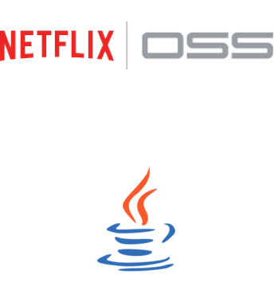
a|
^.^a|
* Distributed configuration
* Service Discovery
* Loadbalancing
* Bulkheading
* Circuit Breaker
* Fallback
* Versioning/Routing
* Based on AWS
|
|===

[NOTE.speaker]
--
* Bulkheading - so that we can still service traffic reliably by isolating the parts of our application that are affected by a slow or misbehaving collaborator
* Circuit breaker - If something's broken, don't call it. If a downstream service is down or throwing errors consistently, then there is not much point in trying to call it repeatedly in quick succession. Rather we'll fail fast and check back every now and then to see if it's recovered.
* Fallback - If the downstream service is sinking and we fail fast, let's give our end users something a bit better than a stacktrace.
--

// ----------------------------------------------------------------------------

=== Eureka Server

* `@EnableEurekaServer`
* Dependency to `cloud-starter-eureka-server`

[source, java]
----
@EnableEurekaServer
@EnableAutoConfiguration
public class EurekaApplication {
  public static void main(String[] args) {
    SpringApplication.run(EurekaApplication.class, args);
  }
}
----

// ----------------------------------------------------------------------------

=== Eureka Client

* Registers automatically with the Eureka server under a defined name
* Can access other Microservices
* Integrates Load Balancing with Ribbon using
** `DiscoveryClient`, `FeignClient`
** Eureka aware `RestTemplate` (sample later)
* `@EnableDiscoveryClient` or `@EnableEurekaClient`
* Dependency to `spring-cloud-starter-eureka`

[source]
----
eureka.client.serviceUrl.defaultZone=http://eureka:8761/eureka/
eureka.instance.leaseRenewalIntervalInSeconds=5
spring.application.name=catalog
eureka.instance.metadataMap.instanceId=ipservice:${random.value}
eureka.instance.preferIpAddress=true
----

// ----------------------------------------------------------------------------

=== `RestTemplate` & Load Balancing

* `@RibbonClient`
* Dependency to `spring-cloud-starter-ribbon`

[source, java]
----
@RibbonClient("ipclient")
... // Left out other Spring Cloud / Boot Annotations
public class IPAddressController {

  @Autowired
  private RestTemplate restTemplate;

  @RequestMapping(value = "/ip", method = RequestMethod.GET)
  public IPAddress ipaddress() throws Exception {
    return template.getForEntity("http://ipservice/ip", IPAddress.class).getBody();
  }
}
----

// ----------------------------------------------------------------------------

=== Hystrix with Annotations

* Java proxies automaticaly created
* Annotations of _javanica_ library
* `@EnableCircuitBreaker` or `@EnableHystrix`, dependency to `spring-cloud-starter-hystrix`

[source, java]
----
@RequestMapping(value = "/ip", method = RequestMethod.GET)
@HystrixCommand(fallbackMethod = "localIP")
public IPAddress ipaddress() throws Exception {
    return template.getForEntity("http://ipservice/ip", IPAddress.class).getBody();
}

public IPAddress localIP() throws UnknownHostException {
    return new IPAddress(++counter, InetAddress.getLocalHost().getHostAddress(),
        config.getMessage());
}
----

// ----------------------------------------------------------------------------

== What about non-java?

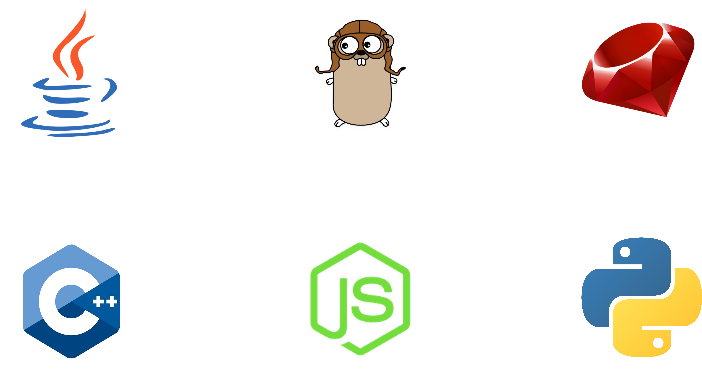

// ----------------------------------------------------------------------------

=== DevOps challenges for multiple containers

[.noredheader,cols="48%,4%,48%"]
|===
.<a|
* How to scale?
* How to avoid port conflicts?
* How to manage them in multiple hosts?
* What happens if a host has a trouble?
a|
.<a|
* How to keep them running?
* How to update them?
* Where are my containers?
|
|===

// ----------------------------------------------------------------------------

=== What if you could do all of this right now with an open-source platform?

* 100% open source, ASL 2.0
* Technology agnostic (java, nodejs, python, golang, etc)
* Built upon decades of industry practices
* 1-click automation
* Cloud native (on premise, public cloud, hybrid)
* Complex build/deploy pipelines (human workflows, approvals, chatops, etc)
* Comprehensive integration inside/outside the platform

// ----------------------------------------------------------------------------

== Meet Kubernetes

[.noredheader,cols="58%,4%,38%"]
|===
.^a|
Greek for _Helmsman_; also the root of the word _Governor_ (from latin: gubernator)

* Container orchestration platform
* Supports multiple cloud and bare-metal environments
* Inspired by Google’s experience with containers
** Rewrite of Google’s internal framework _Borg_
* Open source, written in Go
* Manage applications, not machines
a|
.^a| image::images/kubernetes-logo.png[align="center", width="50%"]
|
|===

[NOTE.speaker]
--
κυβερνήτης means "Helmsman" in Greek. Similarly it's related to the word "Governor"
e.g: "kubernan" in greek means to steer "kubernetes" is helmsman
"gubernare" means to steer or to govern in Latin "gubernator" is "governor" in Latin
--

// ----------------------------------------------------------------------------

=== Kubernetes

[.noredheader,cols="48%,4%,48%"]
|===
.^a|image::images/kubernetes-logo.png[align="center", width="40%"]
a|
.^a|
* Distributed configuration
* Service Discovery
* Load-balancing
* Versioning/Routing
* Deployments
* Scaling/Autoscaling
* Liveness/Health checking
* Self healing
|
|===

// ----------------------------------------------------------------------------

=== Kubernetes Concepts

Pods:: colocated group of containers that share an IP, namespace, storage volume, resources, lifecycle
Replica Set:: manages the lifecycle of pods and ensures specified number are running (next gen Replication Controller)
Service:: Single, stable name for a set of pods, also acts as LB
Label:: used to organize and select group of objects

// ----------------------------------------------------------------------------

=== Kubernetes Concepts

[.noredheader,cols="60%,2%,38%"]
|===
.^a|
Node:: Machine (physical or VM) in the cluster
Master:: Central control plane, provides unified view of the cluster
* etcd: distributed key-value store used to persist Kubernetes system state
Worker:: Docker host running kubelet (node agent) and proxy services
* Runs pods and containers
a|
.^a|
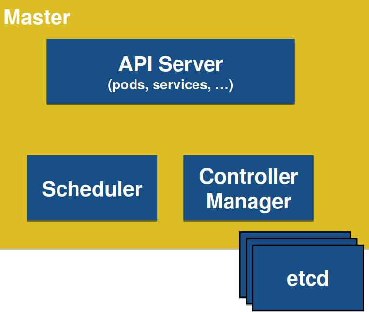
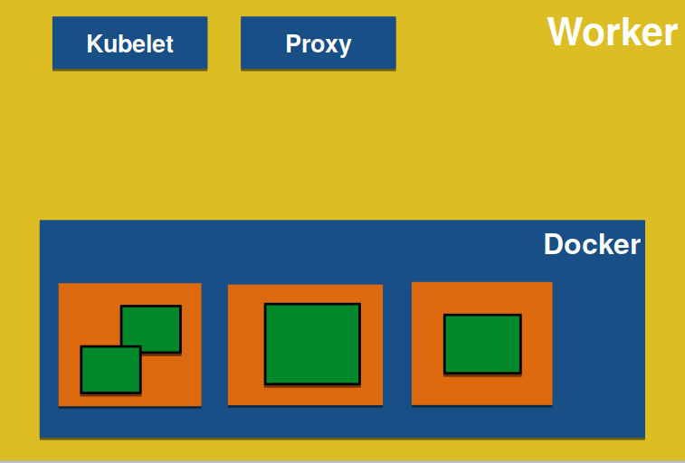
|
|===

// ----------------------------------------------------------------------------

=== !

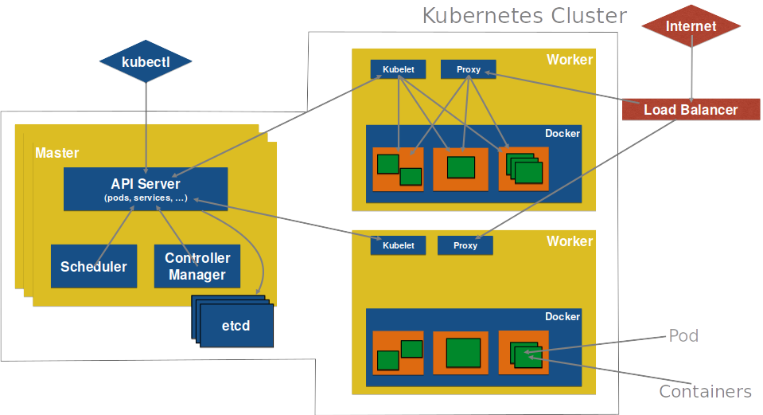

// ----------------------------------------------------------------------------

=== OpenShift is Kubernetes

[.noredheader,cols="48%,4%,48%"]
|===
.^a|
* Team self service application deployment
* Developer focused workflow
* Enterprise ready (LDAP, RBAC, Oauth, etc)
* Higher level abstraction above containers for delivering technology and business value
* Integrated Docker registry
* Jenkins Pipeline out of the box
* Build/deployment triggers
* Software Defined Networking (SDN)
* Docker native format/packaging
* CLI/IDE/Web based tooling
a|
.^a|image::images/openshift-stack.png[align="center", width="100%"]
|
|===

// ----------------------------------------------------------------------------

=== What about client-side load balancing?

[.noredheader,cols="58%,4%,38%"]
|===
.^a|
Spring Cloud Kubernetes:

* DiscoveryClient
* Ribbon integration
* Actuator/Health integrations
* Hystrix/Turbine Dashboard integrations (kubeflix)
* Zipkin Tracking
* Configuration via ConfigMaps
//* Archaius Bridge for dynamic configs
a|
.^a|

image::images/fabric8-logo.png[align="center", width="50%"]
|
|===

// ----------------------------------------------------------------------------

== Demo

// ----------------------------------------------------------------------------

== Typical problems developing microservices

* How to run them all locally? => Minikube, Minishift, CDK
* How to package them => Docker
* How to test? => Arquillian
* Vagrant? VirtualBox? VMs? => Minikube, Minishift, CDK
* Specify configuration => Templates, EnvVars, ConfigMap
* Process isolation => Docker
* Service discovery => Kubernetes
* Multiple versions? => Kubernetes, API manager

// ----------------------------------------------------------------------------

== Fabric8 all the things!

[.noredheader,cols="68%,4%,28%"]
|===
.^a|
* Built on top of Kubernetes
* Wizards to create microservices
* Package as immutable containers
* Rolling upgrade across environments
* 1-Click install of fully configured CI/CD (Jenkins Pipeline, Nexus, Git)
* Feedback loops
* Lots of developer tooling
* ChatOps
* iPaaS/Integration
* Chaos Monkey
a|
.^a|image::images/fabric8-logo.png[align="center", width="80%"]
|
|===

// ***************************************************************************
include::includes/qa-full.adoc[]
include::includes/license-cg.adoc[]
//include::includes/credits.adoc[]
// ***************************************************************************

=== Credits

[.small-text]
--
.Special thanks to all the people who made and released their awesome resources for free:
* link:https://www.slideshare.net/RedHatDevelopers/microservices-for-java-developers[_MicroServices for Java Developers_]
by link:http://twitter.com/christianposta[Christian Posta]
* link:https://www.slideshare.net/ceposta/microservices-with-spring-cloud-netflix-oss-and-kubernetes[_Microservices with Spring Cloud, Netflix OSS and Kubernetes_]
by link:http://twitter.com/christianposta[Christian Posta]
* link:https://www.slideshare.net/RedHatDevelopers/microservices-with-docker-kubernetes-and-jenkins[_Microservices with Docker, Kubernetes, and Jenkins_]
by link:http://twitter.com/rafabene[Rafael Benevides] and link:http://twitter.com/christianposta[Christian Posta]
* link:https://www.slideshare.net/RedHatDevelopers/kubernetes-for-java-developers[_Kubernetes Introduction_]
by link:http://twitter.com/rafabene[Rafael Benevides] and link:http://twitter.com/yanaga[Edson Yanaga]
* link:https://www.slideshare.net/ceposta/chicago-microservices-integration-talk[_Integration in age of DevOps_]
by link:http://twitter.com/christianposta[Christian Posta]
* link:https://github.com/docker/labs/blob/master/slides/docker-introduction.pdf[_Docker for Java Developers_]
by link:http://twitter.com/arungupta[Arun Gupta]
* link:https://github.com/arun-gupta/kubernetes-java-sample/blob/master/slides/kubernetes-for-java-developers.pdf[_Kubernetes for Java Developers_]
by link:http://twitter.com/arungupta[Arun Gupta]
--
